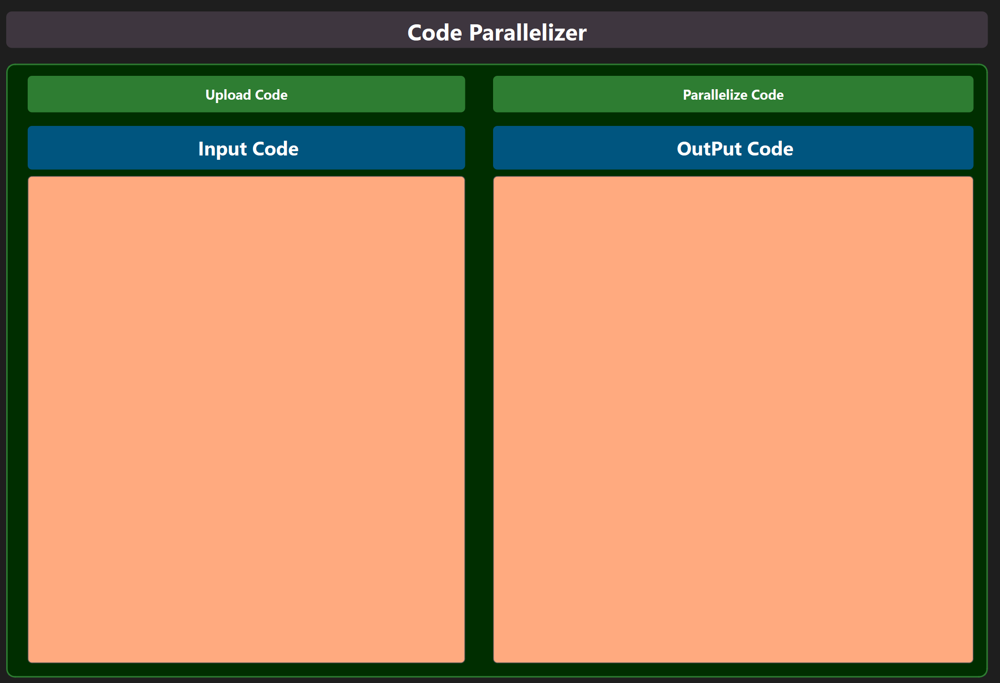
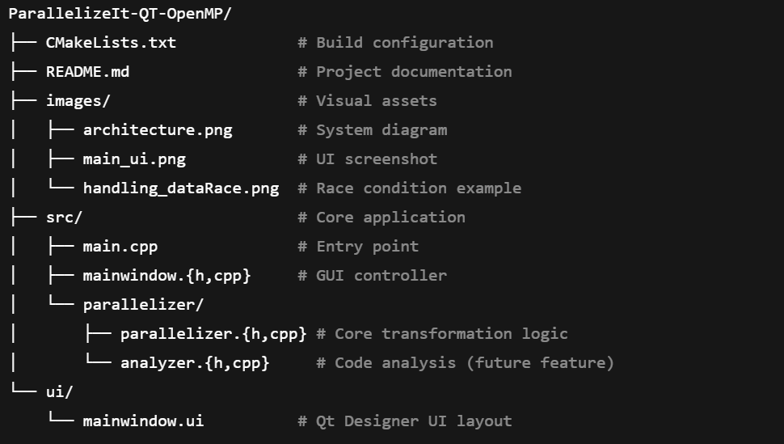
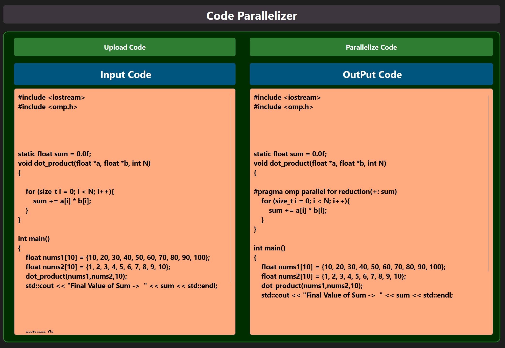
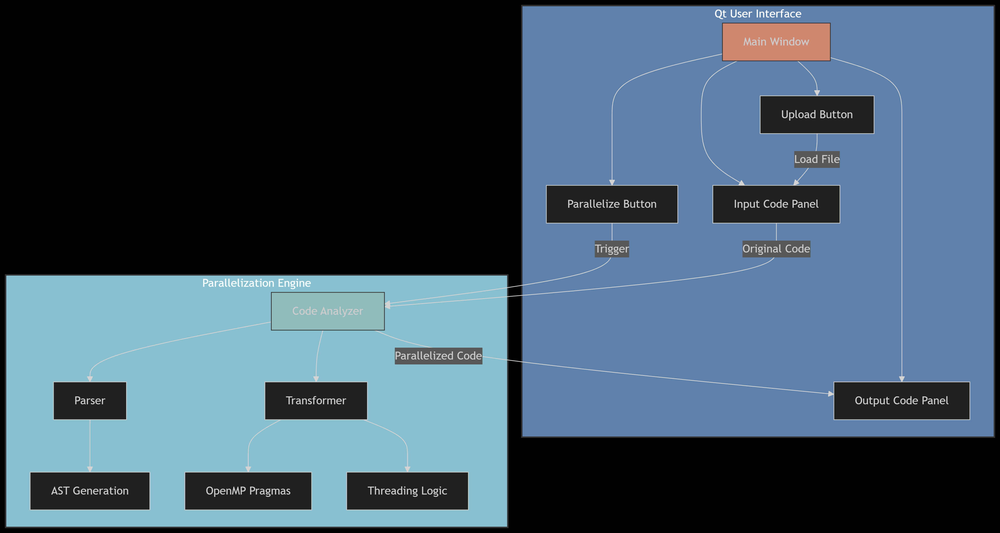

🚀 ParallelizeIt-QT-OpenMP
ParallelizeIt-QT-OpenMP is a Qt-based desktop application that automatically transforms sequential C/C++ code into parallelized versions using OpenMP directives. It is built to help developers optimize their code with minimal manual effort.

🏗️ Project Structure

💡 Key Features
🔧 Core Functionality
Automatic OpenMP Directive Insertion:

#pragma omp parallel for

Critical section protection

Reduction operations (reduction(+:sum), etc.)

Handles basic race conditions using appropriate OpenMP constructs

🖥️ User Interface
Dual-panel code view (original and parallelized)

File upload support for .cpp, .h, and .c

Light and dark theme support

Responsive features:

Line numbers

Syntax highlighting

Zoom controls

🧠 Advanced Capabilities
Basic race condition detection

Loop dependency analysis

Performance estimation (WIP)

🔍 Race Condition Handling Example

This screenshot demonstrates how the tool detected a race condition and applied the appropriate OpenMP directive using reduction(+:sum) to safely parallelize the code.

🧠 System Architecture

⚙️ Build & Run
✅ Requirements
Component	Version	Notes
Qt	≥ 6.6	Qt 6 recommended
C++ Compiler	≥ C++17	GCC, Clang, or MSVC
OpenMP	≥ 4.5	Required for parallelism
CMake	≥ 3.15	Cross-platform build tool

🧪 Build Instructions

# Clone and build
git clone https://github.com/Mohamed-Magdy-Dewidar/ParallelizeIt-QT-OpenMP.git
cd ParallelizeIt-QT-OpenMP

open the .pro file using QT Creator and the run the Project
